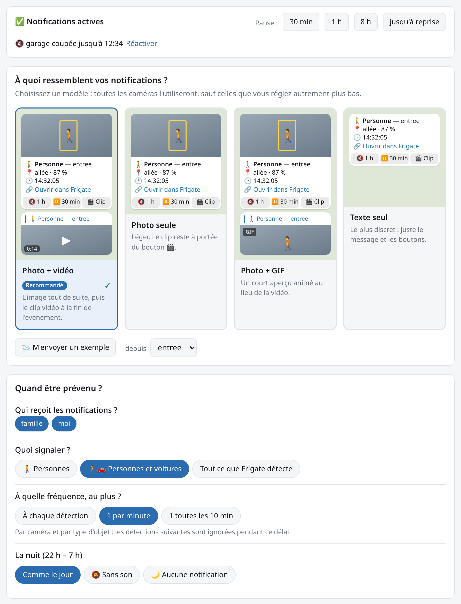
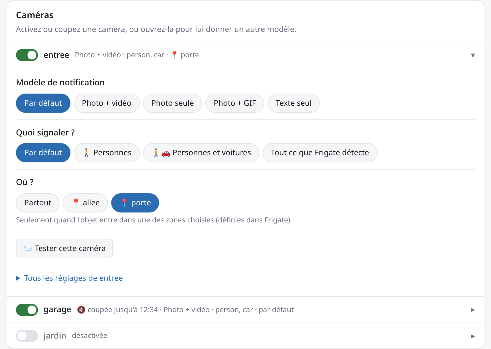
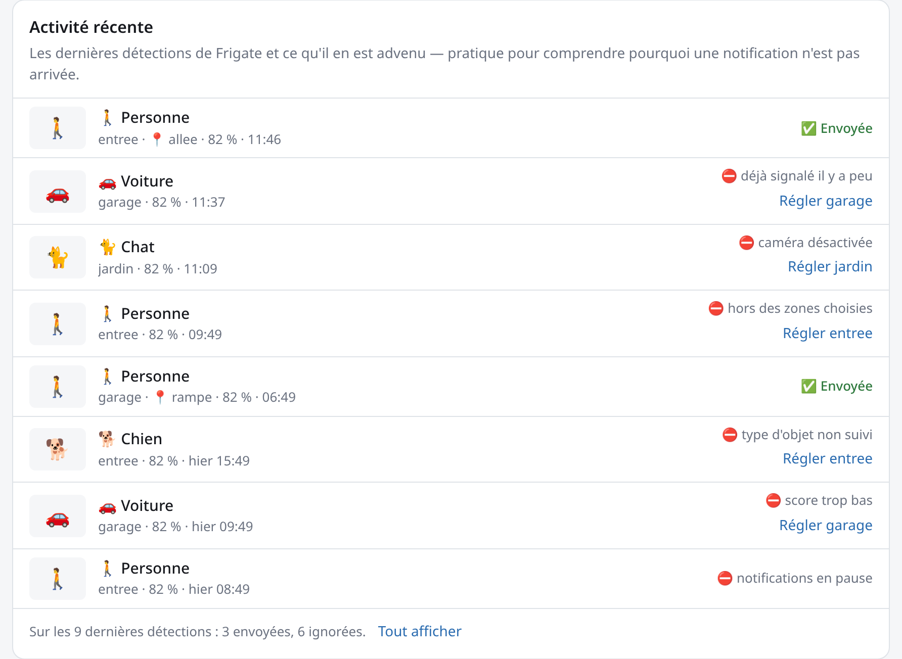
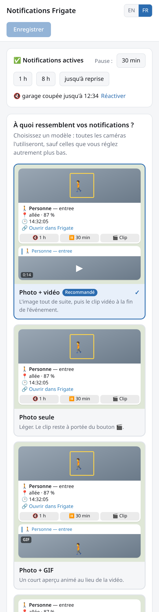
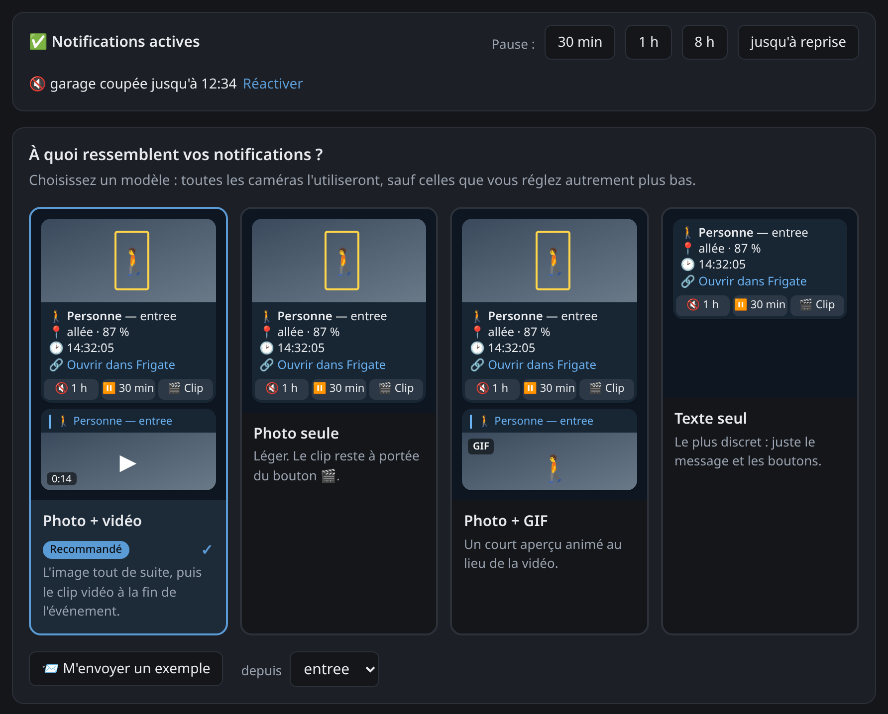

# frigate-telegram

[English](README.md) · **Français**

Notifications Telegram pour [Frigate NVR](https://frigate.video) : un snapshot dès la
détection, puis le clip vidéo en réponse, avec des filtres fins, une interface web pour
tout régler en quelques clics et un pilotage depuis Telegram.

<p align="center">
  
</p>

## Fonctionnalités

- Mode **events** (un message par objet détecté) ou **reviews** (alertes regroupées, Frigate ≥ 0.14)
- Snapshot immédiat, clip MP4 en réponse, et GIF en option ; au-delà de 50 Mo, un lien vers le clip
- Description GenAI de Frigate ajoutée à la légende dès qu'elle est disponible
- Filtres par caméra, objet, zone, score minimum et sévérité ; cooldown ; plages silencieuses et plages coupées
- **Interface web** pour régler tout cela sans éditer de YAML, appliquée sans redémarrage
- Plusieurs destinataires avec routage par caméra
- Boutons 🔇 *couper la caméra 1 h*, ⏸ *pause 30 min*, 🎬 *clip*
- Commandes `/pause`, `/resume`, `/status`, `/cameras`, `/snapshot`, `/last`
- En **anglais** ou en **français** : messages Telegram (`LANGUAGE`) et interface web (sélecteur EN / FR)
- État persistant, `/healthz`, métriques Prometheus, image distroless multi-arch (amd64 et arm64)

## L'interface web en images

**Choisir un modèle de notification.** Quatre modèles — *Photo + vidéo*, *Photo seule*,
*Photo + GIF*, *Texte seul* — chacun avec un aperçu du message tel qu'il arrivera dans
Telegram. Un clic, et toutes les caméras l'adoptent. En dessous, quelques questions à
choix simples : quoi signaler, à quelle fréquence, et que faire la nuit (capture
ci-dessus).

**Régler une caméra.** Un interrupteur par caméra ; en l'ouvrant, on lui donne un autre
modèle, d'autres objets ou seulement certaines zones — sinon elle suit les choix
généraux. *Tester cette caméra* envoie une vraie notification d'exemple.

<p align="center">
  
</p>

**Comprendre pourquoi une notification n'est pas arrivée.** L'activité récente liste les
dernières détections, avec leur issue : ✅ envoyée, ou ⛔ ignorée et pourquoi (hors zone,
score trop bas, déjà signalé il y a peu…), avec un lien direct vers la caméra à régler.

<p align="center">
  
</p>

**Sur téléphone, et en mode sombre.** La page s'adapte à l'écran et suit le thème du système.

<p align="center">
  
  &nbsp;&nbsp;
  
</p>

## Prérequis

1. **MQTT activé dans Frigate** (`config.yml` de Frigate) :

   ```yaml
   mqtt:
     enabled: true
     host: mosquitto
     user: frigate
     password: ...
   ```

2. **Un bot Telegram** : écrire à [@BotFather](https://t.me/BotFather), `/newbot`, puis noter le token.

3. **Votre identifiant Telegram** : écrire un message à votre bot, puis ouvrir
   `https://api.telegram.org/bot<TOKEN>/getUpdates` et relever `message.from.id`.
   Pour un groupe : ajouter le bot au groupe, y écrire un message et relever `message.chat.id` (négatif).

## Installation

1. Télécharger le fichier `docker-compose.yml` :

   ```bash
   curl -O https://raw.githubusercontent.com/Limoniak/frigate-telegram/main/docker-compose.yml
   ```

2. Modifier les variables d'environnement dans `docker-compose.yml` — au minimum les
   quatre obligatoires (voir [Variables d'environnement](#variables-denvironnement)).

3. Déployer :

   ```bash
   docker compose up -d
   ```

Ouvrez ensuite `http://<ip-du-serveur>:8431/` pour choisir ce qui est notifié, puis
*M'envoyer un exemple* pour vérifier que tout arrive bien dans Telegram. Les réglages
de notification (objets, zones, caméras, heures de nuit…) se font dans l'interface web —
aucune variable n'est nécessaire pour eux.

> Si Frigate et son broker MQTT tournent dans Docker sur la même machine, utilisez
> l'adresse IP de la machine dans `FRIGATE_URL` et `MQTT_BROKER` — `localhost`
> désignerait le conteneur frigate-telegram lui-même.

L'image est construite par GitHub Actions et publiée sur GitHub Container Registry :
`ghcr.io/limoniak/frigate-telegram` (amd64 et arm64).

- `:latest` et `:main` — la dernière version de `main`
- `:X.Y.Z` — publiés à chaque tag `v*`
- `:sha-<court>` — un commit précis

Pour mettre à jour : `docker compose pull && docker compose up -d`.

## Variables d'environnement

| Variable | Obligatoire | Description |
|---|---|---|
| `TELEGRAM_TOKEN` | ✅ | Token du bot donné par @BotFather |
| `TELEGRAM_CHAT_ID` | ✅ | Identifiant du destinataire. Plusieurs : `moi=123456789,famille=-1001234567890` (noms libres ; un groupe a un identifiant négatif) |
| `FRIGATE_URL` | ✅ | API de Frigate, ex. `http://192.168.1.10:5000` (5000 sans auth, 8971 avec auth) |
| `MQTT_BROKER` | ✅ | Broker MQTT utilisé par Frigate : `hôte`, `hôte:port`, ou `tcp://…` / `ssl://…` |
| `TZ` | | Fuseau horaire, ex. `Europe/Paris` (défaut : `UTC`) |
| `LANGUAGE` | | Langue des messages Telegram et des erreurs : `en` (défaut) ou `fr` — **mettre `fr` pour du français** |
| `WEB_PASSWORD` | | Mot de passe de l'interface web (vide = aucun) |
| `TELEGRAM_ADMINS` | | Utilisateurs autorisés à piloter le bot (défaut : les chats privés de `TELEGRAM_CHAT_ID` ; obligatoire s'il ne liste que des groupes) |
| `FRIGATE_EXTERNAL_URL` | | URL publique de Frigate, pour les liens « Ouvrir dans Frigate » |
| `FRIGATE_USERNAME` / `FRIGATE_PASSWORD` | | Si l'authentification de Frigate est activée |
| `FRIGATE_INSECURE_SKIP_VERIFY` | | `true` pour un certificat auto-signé |
| `MQTT_USERNAME` / `MQTT_PASSWORD` | | Identifiants MQTT |
| `MQTT_TOPIC_PREFIX` | | Doit correspondre à `mqtt.topic_prefix` de Frigate (défaut : `frigate`) |
| `MQTT_CLIENT_ID` | | Défaut : `frigate-telegram` |
| `MQTT_INSECURE_SKIP_VERIFY` | | `true` pour un certificat auto-signé |
| `MODE` | | `events` (un message par objet, défaut) ou `reviews` (alertes Frigate ≥ 0.14) |
| `WEB_ENABLED` | | `false` pour désactiver l'interface web |
| `WEB_ALLOWED_HOSTS` | | Noms d'hôte acceptés sans mot de passe, ex. `nas.lan` (voir [Accès et sécurité](#accès-et-sécurité)) |
| `WEB_PROTECT_METRICS` | | `true` pour que `/metrics` exige aussi le mot de passe |
| `LOG_LEVEL` | | `debug`, `info` (défaut), `warn`, `error` |

### Avancé : fichier de configuration

À la place des variables d'environnement, tout peut se régler dans un fichier YAML —
pratique pour préparer des réglages par caméra à l'avance ou les versionner. Copier
[`config.example.yml`](config.example.yml) vers `config/config.yml`, l'adapter, et
ajouter ce volume au service :

```yaml
    volumes:
      - ./config:/config:ro
```

Quand `/config/config.yml` existe, il est seul pris en compte ; ses valeurs `${VAR}`
sont lues dans l'environnement du conteneur. Points clés :

- Les réglages de `notify` s'appliquent à toutes les caméras ; une entrée dans `cameras` remplace champ par champ.
- `zones` : ne notifie que si l'objet est **entré** dans une des zones listées.
- `quiet_hours` : notification sans son ; `off_hours` : aucune notification.
- Mode `reviews` : `severity: [alert]` suit la configuration `review.alerts` de Frigate.

## Interface web

`http://<ip-du-serveur>:8431/` sert une page de réglage des notifications, pensée pour se
régler en quelques clics. Elle suit la langue du navigateur (français ou anglais) ; le
sélecteur **EN / FR** de l'en-tête la change, et le choix est retenu.

- **Modèles de notification** : *Photo + vidéo*, *Photo seule*, *Photo + GIF* ou
  *Texte seul*, chacun avec un aperçu du message tel qu'il arrivera dans Telegram.
- **Questions simples** : quoi signaler (personnes, personnes et voitures, tout), à
  quelle fréquence au plus, et quoi faire la nuit (comme le jour, sans son, rien).
- **Caméras** : un interrupteur par caméra ; en l'ouvrant, on lui donne un autre modèle
  ou d'autres objets, sinon elle suit les choix du haut.
- **Où ?** : pour une caméra qui a des zones dans Frigate, « Partout » ou seulement
  certaines zones, en un clic.
- **Essai** : *M'envoyer un exemple* envoie une vraie notification de test aux
  destinataires, avec l'image en direct de la caméra et les réglages enregistrés.
- **Pause** : un bandeau indique si les notifications sont actives ; pause de 30 min,
  1 h, 8 h ou jusqu'à reprise, et réactivation des caméras coupées depuis Telegram.
- **Activité récente** : les 50 dernières détections avec leur miniature et leur
  issue — ✅ envoyée, ou ⛔ ignorée avec la raison en clair (hors zone, score trop bas,
  déjà signalé il y a peu…) et un lien pour régler la caméra concernée. L'historique est
  gardé en mémoire et repart de zéro au redémarrage du service.
- **Alertes de cohérence** : une caméra réglée pour signaler un objet que Frigate n'y
  suit pas (absent de `objects.track`) est signalée.
- **Réglages avancés** (repliés) : tous les réglages en détail — zones, scores,
  plages horaires sur mesure, délais… — en global puis caméra par caméra. Les zones et
  les objets proposés viennent de l'API de Frigate.

Un enregistrement prend effet **immédiatement**, sans redémarrage, et n'est accepté que
s'il est valide — un réglage refusé laisse le service sur les précédents.

Les réglages sont enregistrés dans le volume de données (`/data/notify.yml`), à côté de
l'état (pauses, cooldowns) : ils survivent aux redémarrages et aux mises à jour. Avec un
fichier de configuration, ils **remplacent ses sections `notify` et `cameras`** tant
qu'ils existent ; le bouton *Revenir aux réglages de config.yml* les supprime.
`config.yml` lui-même n'est jamais réécrit.

### Accès et sécurité

Sans mot de passe, l'interface est ouverte à quiconque atteint le port, et le
`docker-compose.yml` fourni publie `8431` sur tout le réseau. **Renseignez
`WEB_PASSWORD`**, ou limitez le port à la machine elle-même avec
`"127.0.0.1:8431:8431"`. (Dans un fichier de configuration : `web.password`,
`web.allowed_hosts`, `web.protect_metrics`.)

Sans mot de passe, l'interface n'accepte en outre que les requêtes adressées à une
adresse IP ou à `localhost` (`http://192.168.1.10:8431/` fonctionne,
`http://nas.lan:8431/` est refusé en 403). Cela bloque le *rebinding DNS*, où un site
malveillant ouvert dans votre navigateur fait pointer son propre domaine vers
`127.0.0.1` pour piloter l'interface à votre insu. Pour passer par un nom d'hôte,
l'ajouter à `WEB_ALLOWED_HOSTS`, ou définir un mot de passe (qui lève ce contrôle).

L'authentification ne couvre que l'interface : `/healthz` reste toujours libre pour la
sonde du conteneur, et `/metrics` aussi, sauf avec `protect_metrics: true`. Si le port
est exposé au réseau, pensez-y : les compteurs par caméra et par objet révèlent quand
il y a de l'activité chez vous — `WEB_PROTECT_METRICS=true` les protège. Prometheus
s'authentifie alors avec `basic_auth` (nom d'utilisateur libre, mot de passe `WEB_PASSWORD`).

## Commandes Telegram

| Commande | Effet |
|---|---|
| `/pause [durée] [caméra]` | Pause globale ou d'une caméra (1 h par défaut, `0` = jusqu'à `/resume`). Durées : `30m`, `2h`, `1d` |
| `/resume [caméra]` | Reprend une caméra, ou tout sans argument |
| `/status` | Connexion MQTT, pauses actives, notifications sur 24 h |
| `/cameras` | Caméras et leur état |
| `/snapshot [caméra]` | Image en direct |
| `/last [caméra]` | Dernier événement (snapshot et clip) |

Seuls les utilisateurs listés dans `telegram.admins` peuvent utiliser les commandes et les boutons.

## Supervision

- `GET /healthz` : 200 si MQTT est connecté et Telegram joignable (utilisé par le `HEALTHCHECK` Docker)
- `GET /metrics` : métriques Prometheus préfixées par `ft_`
- `/healthz` n'est jamais protégée ; `/metrics` l'est par le mot de passe si `WEB_PROTECT_METRICS=true`

## Dépannage

- **Le conteneur s'arrête aussitôt** : `docker compose logs` indique les variables
  d'environnement manquantes ou invalides.
- **Aucune notification** : ouvrir l'*Activité récente* de l'interface web, qui donne la
  raison de chaque détection ignorée. Sinon, `LOG_LEVEL=debug`, puis vérifier
  `ft_events_received_total` et `ft_events_filtered_total{reason=...}` sur `/metrics`.
- **Clip manquant** : augmenter `clip_delay` (Frigate n'a pas encore fini d'écrire le clip).
- **Interface en 403 « hôte non autorisé »** : voir [Accès et sécurité](#accès-et-sécurité)
  — ajouter le nom d'hôte à `WEB_ALLOWED_HOSTS` ou définir un mot de passe.
- **`permission denied` sur `/data`** : n'arrive que si le volume nommé a été remplacé
  par un dossier (`./data:/data`) ; le donner à l'utilisateur du conteneur avec
  `sudo chown 65532:65532 data`.
- **Réglages de l'interface ignorés au démarrage** : le journal indique pourquoi `/data/notify.yml` a été écarté (un chat supprimé de `telegram.chats`, par exemple). Le service repart alors sur `config.yml`.

## Développement

```bash
go test ./...
go build ./cmd/frigate-telegram
```
