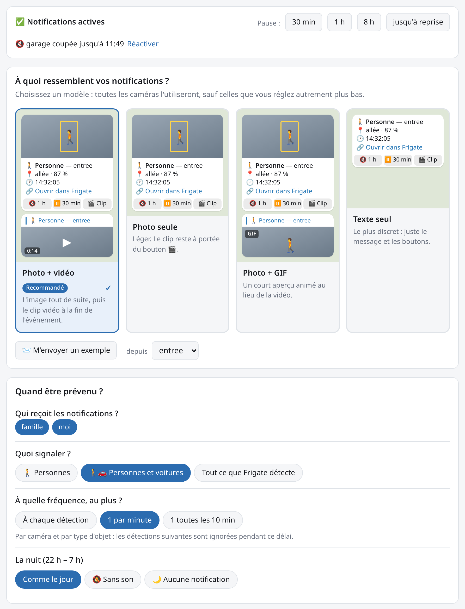
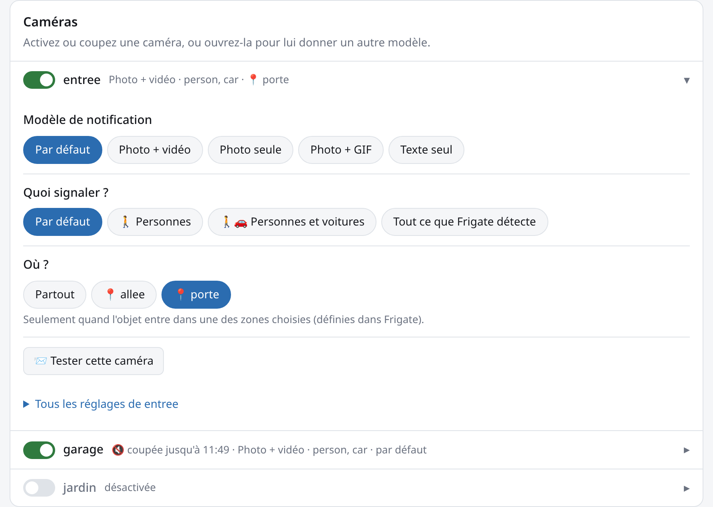
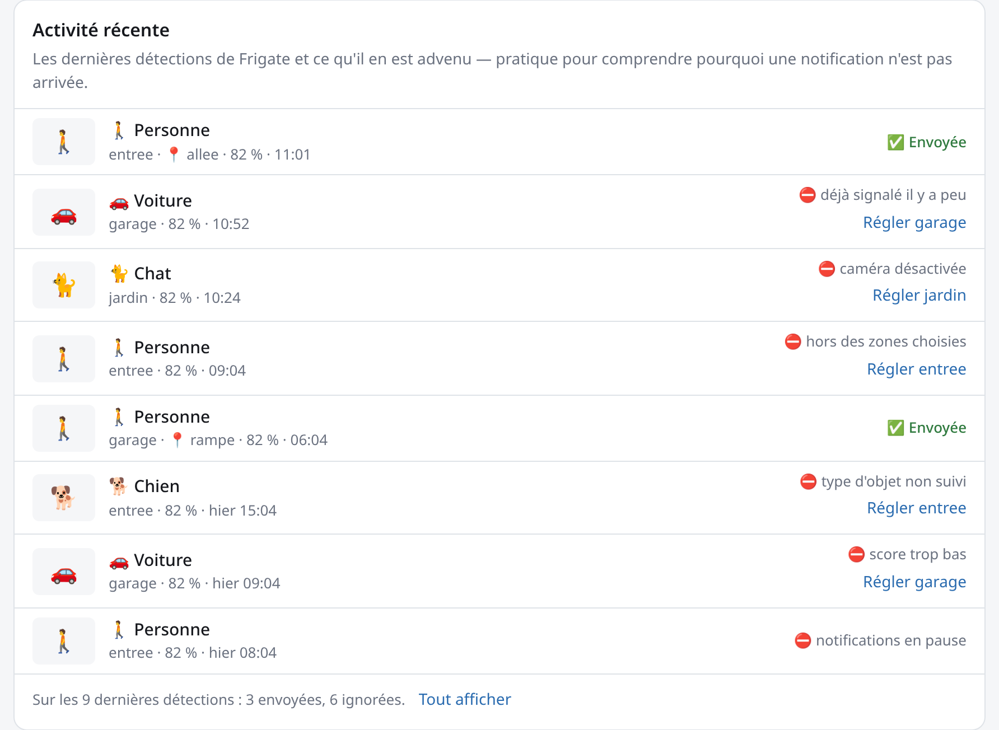
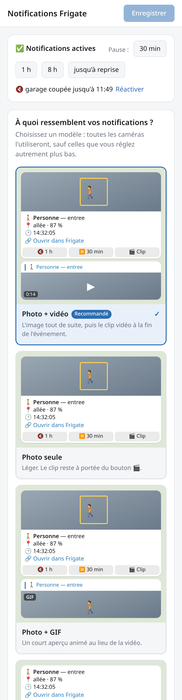
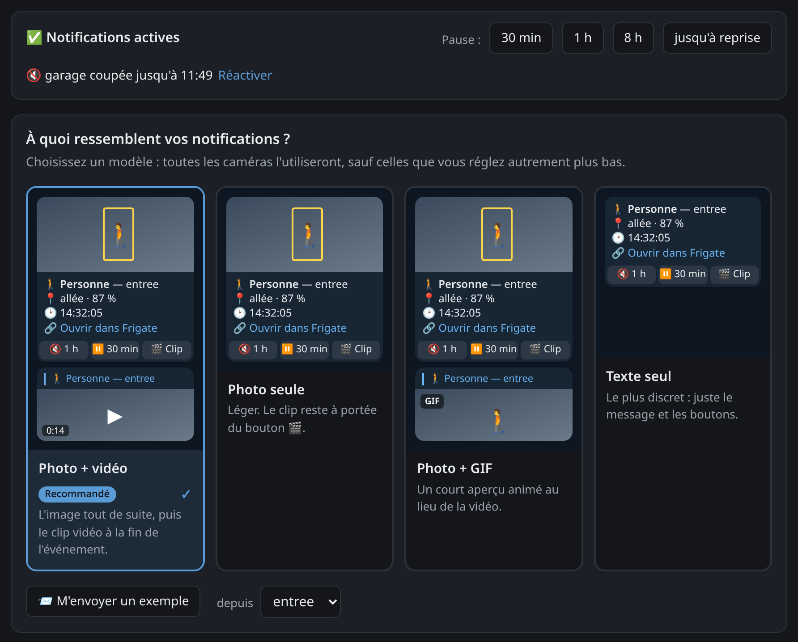

# frigate-telegram

**English** · [Français](README.fr.md)

Telegram notifications for [Frigate NVR](https://frigate.video): a snapshot as soon as
something is detected, then the video clip as a reply — with fine-grained filters, a web
interface to set everything up in a few clicks, and control from Telegram itself.

<p align="center">
  
</p>

> The web interface and the Telegram messages are currently in French.

## Features

- **events** mode (one message per detected object) or **reviews** mode (grouped alerts, Frigate ≥ 0.14)
- Instant snapshot, MP4 clip as a reply, optional GIF; above 50 MB, a link to the clip instead
- Frigate's GenAI description added to the caption as soon as it is available
- Filters per camera, object, zone, minimum score and severity; cooldown; quiet hours and off hours
- **Web interface** to configure all of this without editing YAML, applied without a restart
- Several recipients, with per-camera routing
- Inline buttons: 🔇 *mute camera for 1 h*, ⏸ *pause 30 min*, 🎬 *clip*
- Commands: `/pause`, `/resume`, `/status`, `/cameras`, `/snapshot`, `/last`
- Persistent state, `/healthz`, Prometheus metrics, multi-arch distroless image (amd64 and arm64)

## A tour of the web interface

**Pick a notification style.** Four styles — *photo + video*, *photo only*,
*photo + GIF*, *text only* — each with a preview of the message as it will arrive in
Telegram. One click and every camera uses it. Below, a few multiple-choice questions:
what to report, how often at most, and what to do at night (screenshot above).

**Fine-tune a camera.** Each camera has an on/off switch; open it to give it another
style, other objects or only some zones — otherwise it follows the general choices.
*Test this camera* sends a real sample notification.

<p align="center">
  
</p>

**Find out why a notification didn't arrive.** Recent activity lists the latest
detections and what happened to them: ✅ sent, or ⛔ ignored and why (outside the
selected zones, score too low, already reported a moment ago…), with a direct link to
the camera to adjust.

<p align="center">
  
</p>

**On a phone, and in dark mode.** The page adapts to the screen and follows the system theme.

<p align="center">
  
  &nbsp;&nbsp;
  
</p>

## Requirements

1. **MQTT enabled in Frigate** (Frigate's `config.yml`):

   ```yaml
   mqtt:
     enabled: true
     host: mosquitto
     user: frigate
     password: ...
   ```

2. **A Telegram bot**: message [@BotFather](https://t.me/BotFather), send `/newbot`, and note the token.

3. **Your Telegram ID**: send a message to your bot, then open
   `https://api.telegram.org/bot<TOKEN>/getUpdates` and note `message.from.id`.
   For a group: add the bot to the group, post a message there and note `message.chat.id` (negative).

## Installation

```bash
mkdir -p config data
cp config.example.yml config/config.yml   # then edit it
cp .env.example .env                      # then put the token in it
sudo chown 65532:65532 data               # the image runs as a non-root user (uid 65532)
docker compose up -d
docker compose logs -f
```

Then open `http://127.0.0.1:8080/` to set up notifications, and use
*M'envoyer un exemple* (send me a sample) to check that everything reaches Telegram.

The image is built and published by GitHub Actions to GitHub Container Registry:
`ghcr.io/limoniak/frigate-telegram` (amd64 and arm64).

- `:latest` and `:X.Y.Z` — published on every `v*` tag
- `:main` and `:sha-<short>` — published on every push to `main`

To build locally instead, comment out `image:` and uncomment `build: .`
in [`docker-compose.yml`](docker-compose.yml), then run `docker compose up -d --build`.

## Configuration

Everything is documented in [`config.example.yml`](config.example.yml) (comments in French). Key points:

- `notify` settings apply to every camera; an entry under `cameras` overrides them field by field.
- `zones`: only notify when the object has **entered** one of the listed zones.
- `quiet_hours`: notifications without sound; `off_hours`: no notifications at all.
- `reviews` mode: `severity: [alert]` follows Frigate's `review.alerts` configuration.
- Secrets go in `.env` (`${TELEGRAM_TOKEN}`…). Quote the values in the YAML.

## Web interface

`http://127.0.0.1:8080/` serves a page to configure notifications, designed to be set
up in a few clicks:

- **Notification styles**: photo + video, photo only, photo + GIF or text only, each
  with a preview of the message as it will arrive in Telegram.
- **Simple questions**: what to report (people, people and cars, everything), how often
  at most, and what to do at night (same as daytime, silent, nothing).
- **Cameras**: one switch per camera; open it to give it another style or other
  objects, otherwise it follows the choices above.
- **Where?**: for a camera with zones defined in Frigate, "everywhere" or only some
  zones, in one click.
- **Try it**: the sample button sends a real test notification to the recipients, with
  the camera's live image and the saved settings.
- **Pause**: a banner shows whether notifications are active; pause for 30 min, 1 h,
  8 h or until resumed, and re-enable cameras muted from Telegram.
- **Recent activity**: the last 50 detections with their thumbnail and outcome —
  ✅ sent, or ⛔ ignored with the reason in plain words (outside the zones, score too
  low, already reported a moment ago…) and a link to adjust the camera. The history is
  kept in memory and starts over when the service restarts.
- **Consistency warnings**: a camera set to report an object that Frigate does not
  track on it (missing from `objects.track`) is flagged.
- **Advanced settings** (collapsed): every setting in detail — zones, scores, custom
  time ranges, delays… — globally, then camera by camera. The zones and objects offered
  come from Frigate's API.

Saving takes effect **immediately**, without a restart, and is only accepted if valid —
a rejected change leaves the service on the previous settings.

Settings are written to `/data/notify.yml`, next to the state, and **replace the
`notify` and `cameras` sections of `config.yml`** as long as that file exists; the
*Revenir aux réglages de config.yml* (back to config.yml) button deletes it.
`config.yml` remains the source of secrets, `${VAR}`s and comments, and is never
rewritten — which is necessary anyway, since the container mounts it read-only.

### Access and security

```yaml
web:
  enabled: true                  # false to not serve the interface at all
  password: "${WEB_PASSWORD:-}"  # empty = no authentication
  allowed_hosts: []              # host names accepted without a password (e.g. [nas.lan])
  protect_metrics: false         # true = /metrics requires the password too
```

Without a password, the interface is open to anyone who can reach the port: the
provided `docker-compose.yml` only publishes `8080` on `127.0.0.1`. To reach it from
the network or through a reverse proxy, set `WEB_PASSWORD` in `.env`.

Without a password, the interface also only accepts requests addressed to an IP
address or to `localhost` (`http://192.168.1.10:8080/` works, `http://nas.lan:8080/` is
rejected with a 403). This blocks *DNS rebinding*, where a malicious site open in your
browser points its own domain at `127.0.0.1` to drive the interface behind your back.
To use a host name, add it to `web.allowed_hosts`, or set a password (which lifts this
check).

Authentication only covers the interface: `/healthz` always stays open for the
container probe, and so does `/metrics`, unless `protect_metrics: true`. Keep this in
mind if the port is exposed to the network: per-camera and per-object counters reveal
when there is activity at your place. Prometheus then authenticates with `basic_auth`
(any user name, password `WEB_PASSWORD`).

## Telegram commands

| Command | Effect |
|---|---|
| `/pause [duration] [camera]` | Pause everything or one camera (1 h by default, `0` = until `/resume`). Durations: `30m`, `2h`, `1d` |
| `/resume [camera]` | Resume one camera, or everything without an argument |
| `/status` | MQTT connection, active pauses, notifications over 24 h |
| `/cameras` | Cameras and their state |
| `/snapshot [camera]` | Live image |
| `/last [camera]` | Latest event (snapshot and clip) |

Only the users listed in `telegram.admins` can use the commands and buttons.

## Monitoring

- `GET /healthz`: 200 when MQTT is connected and Telegram is reachable (used by the Docker `HEALTHCHECK`)
- `GET /metrics`: Prometheus metrics prefixed with `ft_`
- `/healthz` is never protected; `/metrics` is protected by `web.password` when `web.protect_metrics: true`

## Troubleshooting

- **No notifications**: open *recent activity* in the web interface, which gives the
  reason for every ignored detection. Otherwise, set `log_level: debug`, then check
  `ft_events_received_total` and `ft_events_filtered_total{reason=...}` on `/metrics`.
- **Missing clip**: increase `clip_delay` (Frigate hasn't finished writing the clip yet).
- **Interface returns 403 "hôte non autorisé" (host not allowed)**: see
  [Access and security](#access-and-security) — add the host name to
  `web.allowed_hosts` or set a password.
- **`permission denied` on `/data`**: see the `chown` step in the installation. The web interface cannot save without it.
- **Interface settings ignored at startup**: the log explains why `/data/notify.yml` was set aside (a chat removed from `telegram.chats`, for example). The service then falls back to `config.yml`.

## Development

```bash
go test ./...
go build ./cmd/frigate-telegram
```
