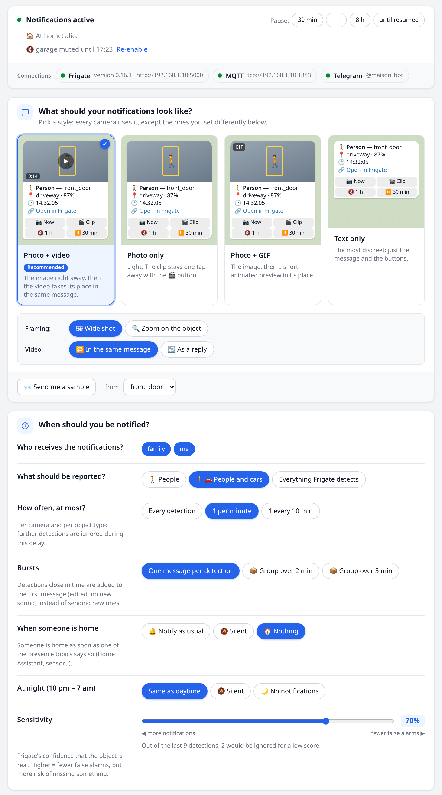
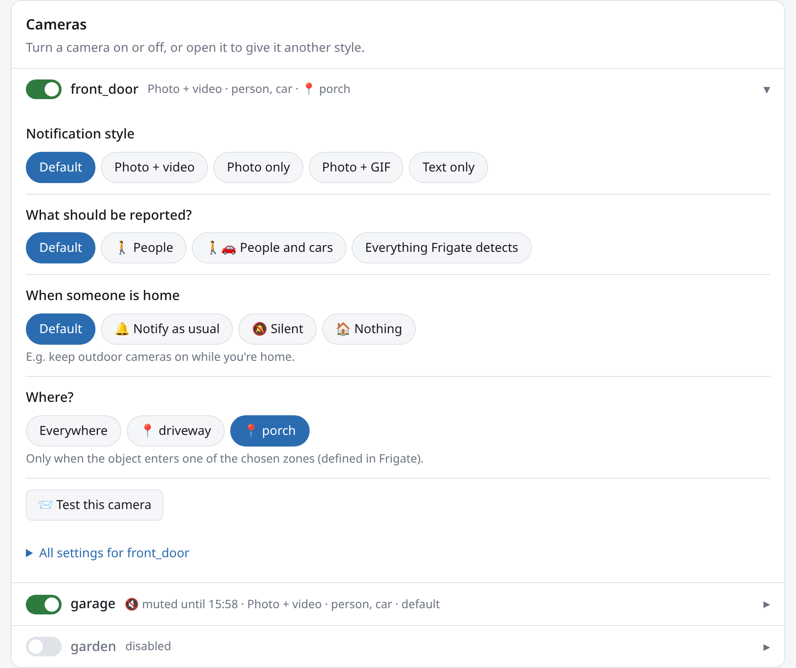
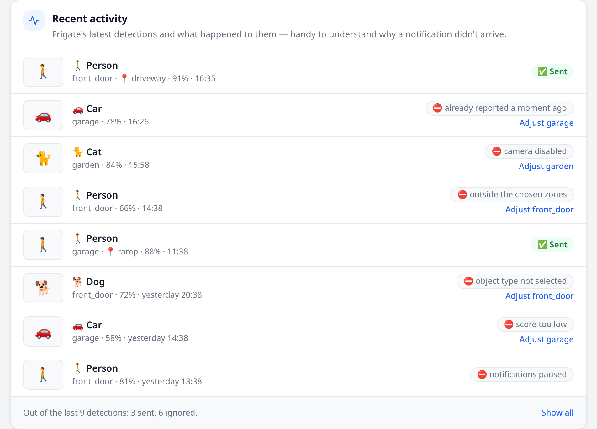
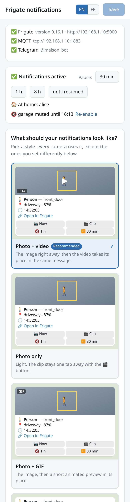
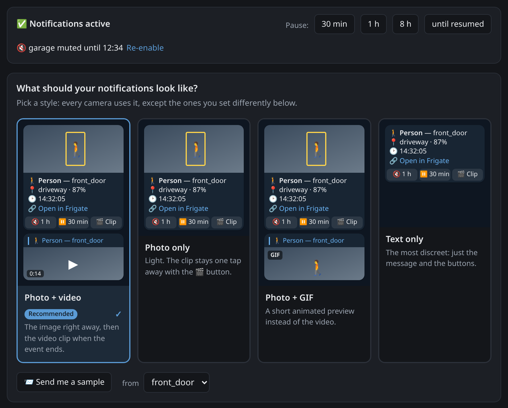

# frigate-telegram-enhanced

**English** · [Français](README.fr.md)

Telegram notifications for [Frigate NVR](https://frigate.video): a snapshot as soon as
something is detected, then the video clip in the same message — with fine-grained filters, a web
interface to set everything up in a few clicks, and control from Telegram itself.

<p align="center">
  
</p>

## Features

- **events** mode (one message per detected object) or **reviews** mode (grouped alerts, Frigate ≥ 0.14)
- Instant snapshot, then the MP4 clip **in the same message** (it replaces the image, no second notification) or as a reply; optional GIF; above 50 MB, a link to the clip instead
- Frigate's GenAI description added to the caption as soon as it is available
- Frigate's labels (custom classification such as your car's name, faces, license plates) added to the caption as soon as Frigate knows them — `🏷 clio 3`
- **Label filter**: don't get notified for your own car or cat, or only for unknown objects (waits up to 5 s for Frigate to recognize the object, only when this filter is on)
- Filters per camera, object, zone, minimum score and severity; cooldown; quiet hours and off hours
- **Web interface** to configure all of this without editing YAML, applied without a restart
- Several recipients, with per-camera routing
- Buttons on each notification: 📷 *now* (live image, to see if the person is still there), 🎬 *clip*, 🔇 *mute camera for 1 h*, ⏸ *pause 30 min*
- `/menu`: a control panel with buttons to pause, resume and mute each camera
- Commands: `/pause`, `/resume`, `/status`, `/cameras`, `/snapshot`, `/last`
- **Burst grouping**: detections close in time are added to the first message instead of sending new ones
- **Cropped snapshots**: the image zoomed on the detected object, much more readable on a phone
- In **English** or **French**: Telegram messages (`LANGUAGE`) and the web interface (EN / FR switch)
- **Presence**: no notifications (or silent ones) while someone is home, from Home Assistant or any MQTT topic
- **Per-recipient settings**: e.g. you get everything, the family only people at night
- After an MQTT outage, detections missed during the last hour are caught up from Frigate
- Persistent state, `/healthz`, Prometheus metrics, multi-arch distroless image (amd64 and arm64)

## A tour of the web interface

**Pick a notification style.** Four styles — *photo + video*, *photo only*,
*photo + GIF*, *text only* — each with a preview of the message as it will arrive in
Telegram. One click and every camera uses it. Below, a few multiple-choice questions:
what to report, how often at most, and what to do at night (screenshot above).

**Fine-tune a camera.** Each camera has an on/off switch; open it to give it another
style, other objects or only some zones — otherwise it follows the general choices.
*Test this camera* sends a real sample notification.

<p align="center">
  
</p>

**Find out why a notification didn't arrive.** Recent activity lists the latest
detections and what happened to them: ✅ sent, or ⛔ ignored and why (outside the
selected zones, score too low, already reported a moment ago…), with a direct link to
the camera to adjust.

<p align="center">
  
</p>

**On a phone, and in dark mode.** The page adapts to the screen and follows the system theme.

<p align="center">
  
  &nbsp;&nbsp;
  
</p>

## Requirements

1. **MQTT enabled in Frigate** (Frigate's `config.yml`):

   ```yaml
   mqtt:
     enabled: true
     host: mosquitto
     user: frigate
     password: ...
   ```

2. **A Telegram bot**: message [@BotFather](https://t.me/BotFather), send `/newbot`, and note the token.

3. **Your Telegram ID**: if you don't know it, start the service with any number in
   `TELEGRAM_CHAT_ID`, then send `/start` to your bot: it answers with your ID, which the
   web interface also lists under *Status*. Put it in `TELEGRAM_CHAT_ID` and restart.
   Before the service runs, you can also send a message to your bot, open
   `https://api.telegram.org/bot<TOKEN>/getUpdates` and note `message.from.id`.
   For a group: add the bot to the group, post a message there and note `message.chat.id` (negative).

## Installation

1. Download the `docker-compose.yml` file:

   ```bash
   curl -O https://raw.githubusercontent.com/Limoniak/frigate-telegram-enhanced/main/docker-compose.yml
   ```

2. Change the environment variables in `docker-compose.yml` — at least the four
   required ones (see [Environment variables](#environment-variables)).

3. Deploy:

   ```bash
   docker compose up -d
   ```

Then open `http://<server-ip>:8431/` to choose what gets notified, and use
*Send me a sample* to check that everything reaches Telegram.
Notification settings (objects, zones, cameras, night hours…) are made in the web
interface — no variable needed for those.

> If Frigate and its MQTT broker run in Docker on the same machine, use the machine's
> IP address in `FRIGATE_URL` and `MQTT_BROKER` — `localhost` would point to the
> frigate-telegram-enhanced container itself.

The image is built by GitHub Actions and published to GitHub Container Registry:
`ghcr.io/limoniak/frigate-telegram-enhanced` (amd64 and arm64).

- `:latest` and `:main` — the latest version of `main`
- `:X.Y.Z` — published on every `v*` tag
- `:sha-<short>` — a specific commit

To update: `docker compose pull && docker compose up -d`.

## Environment variables

| Variable | Required | Description |
|---|---|---|
| `TELEGRAM_TOKEN` | ✅ | Bot token given by @BotFather |
| `TELEGRAM_CHAT_ID` | ✅ | Recipient ID. Several: `me=123456789,family=-1001234567890` (names are free; a group ID is negative) |
| `FRIGATE_URL` | ✅ | Frigate API, e.g. `http://192.168.1.10:5000` (5000 without auth, 8971 with auth) |
| `MQTT_BROKER` | ✅ | MQTT broker used by Frigate: `host`, `host:port`, or `tcp://…` / `ssl://…` |
| `TZ` | | Time zone, e.g. `Europe/Paris` (default: `UTC`) |
| `LANGUAGE` | | Language of Telegram messages and error messages: `en` (default) or `fr` (logs are always in English) |
| `WEB_PASSWORD` | | Password for the web interface (empty = none) |
| `TELEGRAM_ADMINS` | | User IDs allowed to control the bot (default: the private chats of `TELEGRAM_CHAT_ID`; required if it only lists groups) |
| `FRIGATE_EXTERNAL_URL` | | Frigate address used by the "Open in Frigate" links (default: `FRIGATE_URL`; also editable in the web interface) — set it to open Frigate from outside your network |
| `FRIGATE_USERNAME` / `FRIGATE_PASSWORD` | | If Frigate authentication is enabled |
| `FRIGATE_INSECURE_SKIP_VERIFY` | | `true` for a self-signed certificate |
| `MQTT_USERNAME` / `MQTT_PASSWORD` | | MQTT credentials |
| `MQTT_TOPIC_PREFIX` | | Must match Frigate's `mqtt.topic_prefix` (default: `frigate`) |
| `MQTT_CLIENT_ID` | | Default: `frigate-telegram-enhanced` |
| `MQTT_INSECURE_SKIP_VERIFY` | | `true` for a self-signed certificate |
| `MODE` | | `events` (one message per object, default) or `reviews` (Frigate ≥ 0.14 alerts) |
| `WEB_ENABLED` | | `false` to disable the web interface |
| `WEB_ALLOWED_HOSTS` | | Host names accepted without a password, e.g. `nas.lan` (see [Access and security](#access-and-security)) |
| `WEB_PROTECT_METRICS` | | `true` so that `/metrics` requires the password too |
| `PRESENCE_TOPICS` | | MQTT topics telling who is home, comma-separated, `+` and `#` wildcards allowed (see [Presence](#presence)) |
| `PRESENCE_HOME_VALUES` | | Values meaning "home" (default: `home,on,true,1,present`) |
| `LOG_LEVEL` | | `debug`, `info` (default), `warn`, `error` |

### Advanced: configuration file

Instead of environment variables, everything can be set in a YAML file — useful to
prepare per-camera settings in advance or to keep them under version control. Copy
[`config.example.yml`](config.example.yml) (comments in French) to `config/config.yml`,
edit it, and add this volume to the service:

```yaml
    volumes:
      - ./config:/config:ro
```

When `/config/config.yml` exists, it is the only source of configuration; `${VAR}`
values in it are read from the container's environment. Key points:

- `notify` settings apply to every camera; an entry under `cameras` overrides them field by field.
- `zones`: only notify when the object has **entered** one of the listed zones.
- `quiet_hours`: notifications without sound; `off_hours`: no notifications at all.
- `reviews` mode: `severity: [alert]` follows Frigate's `review.alerts` configuration.

## Web interface

`http://<server-ip>:8431/` serves a page to configure notifications, designed to be set
up in a few clicks. It follows the browser's language (English or French); the
**EN / FR** switch in the header changes it and is remembered. On a wide screen, a side
menu jumps to each section.

- **Status**: one card at the top with the connections to Frigate, MQTT and Telegram,
  whether notifications are active, who is home and which cameras are muted. When a
  connection fails, the cause in plain words and the variable to fix (wrong password,
  unreachable address, invalid token, `localhost` used inside Docker…). Pause for
  30 min, 1 h, 8 h or until resumed, and re-enable cameras muted from Telegram.
- **Notification styles**: photo + video, photo only, photo + GIF or text only, each
  with a preview of the message as it will arrive in Telegram.
- **Simple questions**: what to report (people, people and cars, everything), how often
  at most, what to do at night (same as daytime, silent, nothing) and, with presence
  set up, when someone is home.
- **Bursts**: one message per detection, or detections within 2 or 5 minutes added to
  the first message (edited, so no extra sound). **Framing**: wide shot or zoom on the
  object. **Video**: in the same message as the image, or as a reply.
- **Sensitivity**: a slider for the minimum score that shows, on recent activity, how
  many detections would have been ignored.
- **Recipients** (with several chats): what each person receives — every object, people
  only, people and cars — and when — all the time, only at night, only during the day,
  silent at night.
- **Cameras**: one switch per camera; open it to give it another style or other
  objects, otherwise it follows the choices above.
- **Where?**: for a camera with zones defined in Frigate, "everywhere" or only some
  zones, in one click.
- **Try it**: the sample button sends a real test notification to the recipients, with
  the camera's live image and the saved settings.
- **Recent activity**: the last 50 detections with their thumbnail and outcome —
  ✅ sent, or ⛔ ignored with the reason in plain words (outside the zones, score too
  low, already reported a moment ago…) and a link to adjust the camera. The history is
  kept in memory and starts over when the service restarts.
- **Consistency warnings**: a camera set to report an object that Frigate does not
  track on it (missing from `objects.track`) is flagged.
- **Advanced settings** (collapsed): every setting in detail, sorted by theme —
  recipients and filtering, media, pace, schedule and presence, links — globally, then
  camera by camera. The zones and objects offered come from Frigate's API. **Links**
  holds the address used by "Open in Frigate" (default: `FRIGATE_URL`), with a button
  to test it.

As soon as something changes, a bar appears at the bottom of the page with **Save**
and **Cancel**. Saving takes effect **immediately**, without a restart, and is only
accepted if valid — a rejected change leaves the service on the previous settings.

Settings are saved in the data volume (`/data/notify.yml`), next to the state (pauses,
cooldowns) and the recent activity, so they survive restarts and updates. With a configuration file, they
**replace its `notify` and `cameras` sections** as long as they exist; the
*Back to the config.yml settings* button deletes them.
`config.yml` itself is never rewritten.

### Presence

Set `PRESENCE_TOPICS` to one or more MQTT topics that tell whether someone is home.
Someone is home as soon as one of them carries `home` (or `on`, `true`, `1`,
`present`). While someone is home, each camera follows its *When someone is home*
setting: nothing (default), silent, or as usual — handy to keep outdoor cameras on.

With Home Assistant, publish the `person` entities to MQTT, for instance with
[`mqtt_statestream`](https://www.home-assistant.io/integrations/mqtt_statestream/):

```yaml
# Home Assistant configuration.yaml
mqtt_statestream:
  base_topic: homeassistant
  include:
    domains: [person]
```

then `PRESENCE_TOPICS: "homeassistant/person/+/state"`. `/status` in Telegram and the
web interface show who is home.

### Access and security

Without a password, the interface is open to anyone who can reach the port, and the
provided `docker-compose.yml` publishes `8431` on the whole network. **Set
`WEB_PASSWORD`**, or restrict the port to the machine itself with
`"127.0.0.1:8431:8431"`. (In a configuration file: `web.password`,
`web.allowed_hosts`, `web.protect_metrics`.)

Without a password, the interface also only accepts requests addressed to an IP
address or to `localhost` (`http://192.168.1.10:8431/` works, `http://nas.lan:8431/` is
rejected with a 403). This blocks *DNS rebinding*, where a malicious site open in your
browser points its own domain at `127.0.0.1` to drive the interface behind your back.
To use a host name, add it to `WEB_ALLOWED_HOSTS`, or set a password (which lifts this
check).

After 5 wrong passwords within a minute, an address is blocked for 5 minutes.

Authentication only covers the interface: `/healthz` always stays open for the
container probe, and so does `/metrics`, unless `protect_metrics: true`. Keep this in
mind if the port is exposed to the network: per-camera and per-object counters reveal
when there is activity at your place — `WEB_PROTECT_METRICS=true` protects them.
Prometheus then authenticates with `basic_auth` (any user name, password `WEB_PASSWORD`).

## Telegram commands

| Command | Effect |
|---|---|
| `/menu` | Control panel: pause / resume, and a button per camera to mute it for 1 h or turn it back on |
| `/pause [duration] [camera]` | Pause everything or one camera (1 h by default, `0` = until `/resume`). Durations: `30m`, `2h`, `1d` |
| `/resume [camera]` | Resume one camera, or everything without an argument |
| `/status` | MQTT connection, active pauses, notifications over 24 h |
| `/cameras` | Cameras and their state |
| `/snapshot [camera]` | Live image |
| `/last [camera]` | Latest event (snapshot and clip) |

Only the users listed in `telegram.admins` can use the commands and buttons.

## Monitoring

- `GET /healthz`: 200 when MQTT is connected and Telegram is reachable (used by the Docker `HEALTHCHECK`)
- `GET /metrics`: Prometheus metrics prefixed with `ft_`
- `/healthz` is never protected; `/metrics` is protected by the password when `WEB_PROTECT_METRICS=true`

## Troubleshooting

- **The container stops right away**: `docker compose logs` names the missing or
  invalid environment variables.
- **No notifications**: open *recent activity* in the web interface, which gives the
  reason for every ignored detection. Otherwise, set `LOG_LEVEL=debug`, then check
  `ft_events_received_total` and `ft_events_filtered_total{reason=...}` on `/metrics`.
- **Missing clip**: increase `clip_delay` (Frigate hasn't finished writing the clip yet).
- **Interface returns 403 "host not allowed"**: see
  [Access and security](#access-and-security) — add the host name to
  `WEB_ALLOWED_HOSTS` or set a password.
- **`permission denied` on `/data`**: only happens if you replaced the named volume with
  a folder (`./data:/data`); give it to the container's user with
  `sudo chown 65532:65532 data`.
- **Interface settings ignored at startup**: the log explains why `/data/notify.yml` was set aside (a chat removed from `telegram.chats`, for example). The service then falls back to `config.yml`.

## Development

```bash
go test ./...
go build ./cmd/frigate-telegram-enhanced
```
